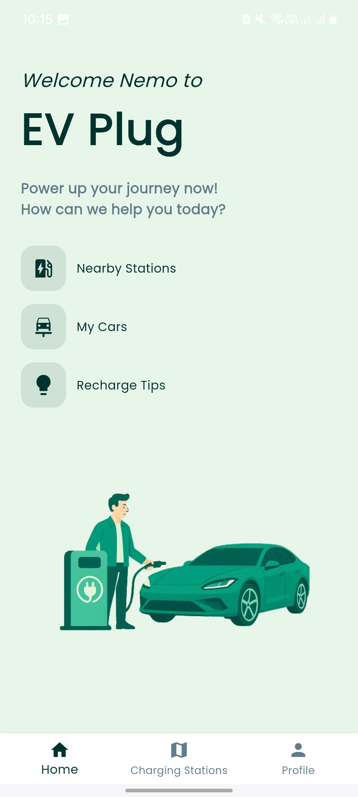
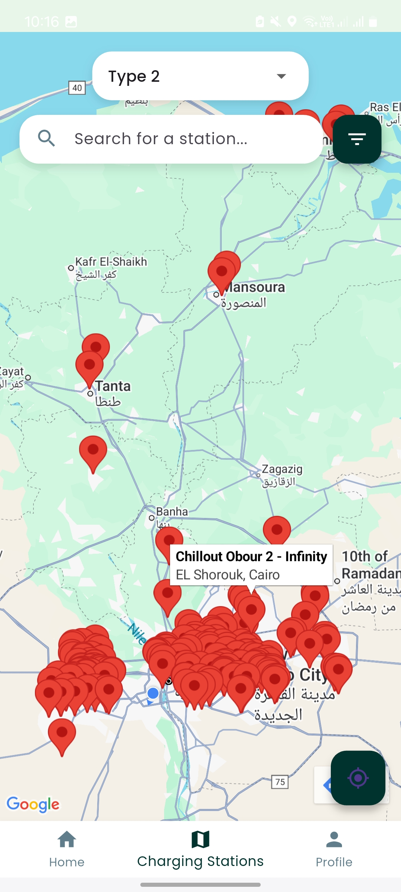

# 🔌 EV Plug

**EV Plug** is a smart cross-platform mobile application built with Flutter to help electric vehicle (EV) drivers locate nearby, compatible charging stations based on their car’s plug type. It leverages Firebase for backend services and Google APIs for maps, distance filtering, and geolocation. The app is designed to provide a personalized, reliable, and efficient EV charging experience—especially in emerging markets where EV infrastructure is still developing.

---

## 🚗 Problem It Solves

EV drivers often struggle to:
- Find charging stations compatible with their vehicle’s plug type.
- Filter results by charger type in traditional apps like Google Maps.
- Avoid manual verification every time they charge.

**EV Plug** solves this by offering:
- Multi-car registration and charger type saving.
- Charger-type filtering based on saved vehicles.
- Distance-based filtering using Google Distance Matrix API (20km).

---

## ✨ Features

- 🔐 Firebase Authentication (Sign up, Login, Reset password).
- 🚘 Multiple car profiles with saved charger types.
- 🗺️ Google Maps integration.
- 🔌 Charger type filtering (CCS2, Type 2, CHAdeMO, GB/T)
- 📍 Nearby station filtering using real-world driving distance.
- 📶 Offline detection and error alerts (connectivity_plus).
- 📚 Recharge tips to promote battery health and smart charging.
- 🎨 Animated and modern user interface.

---

## 🧰 Tech Stack

| Tech / Tool            | Description                                      |
|------------------------|--------------------------------------------------|
| **Flutter**            | Cross-platform mobile app framework              |
| **Firebase Auth**      | Secure authentication                           |
| **Cloud Firestore**    | Real-time NoSQL database                         |
| **Google Maps API**    | Display map and stations                        |
| **Google Distance Matrix API** | Driving distance calculations         |
| **Geolocator**         | Get user’s current location                      |
| **connectivity_plus**  | Monitor network connectivity                     |
| **google_fonts**       | Custom typography (Poppins)                      |

---

## 📁 Main Screens

- `welcome_screen.dart`: Animated splash + onboarding
- `login_screen.dart`: Email/password login
- `register_screen.dart`: User & car registration form
- `map_screen.dart`: Map with station filtering
- `profile_screen.dart`: User info + registered cars
- `home_screen.dart`: Personalized greeting + actions
- `registration_success_screen.dart`: Confirmation message

---

<p align="center">
  
  
</p>
For more screnshots please check the Screenshot file.


## 🚀 Getting Started

### Prerequisites

- Flutter SDK
- Firebase project (with Auth & Firestore enabled)
- Google Maps API Key

## 🤝 Contributing
Pull requests are welcome! For major changes, please open an issue first to discuss your idea.

### Installation

1. Clone the repo:

```bash
git clone https://github.com/ranemahmed/EV-Plug.git
cd EV-Plug
``` 

2. Get Dependencies:

```bash
flutter pub get
``` 

3. Run App:

```bash
flutter run
``` 

